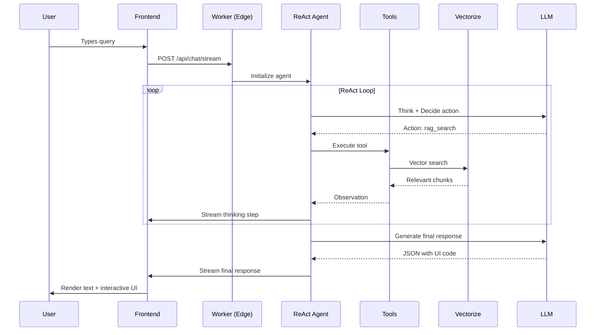
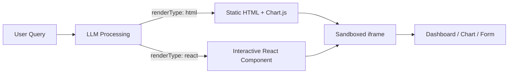
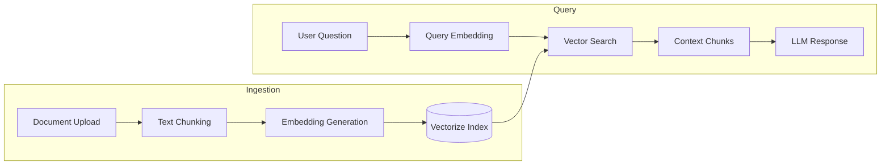
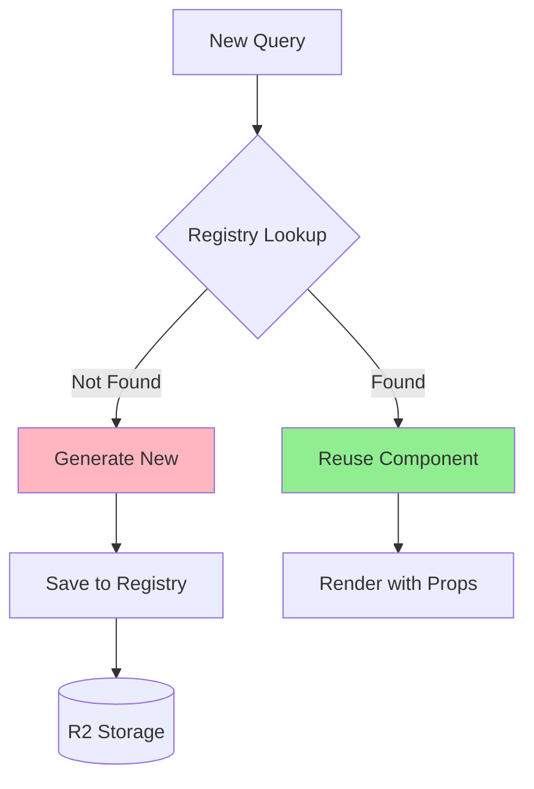
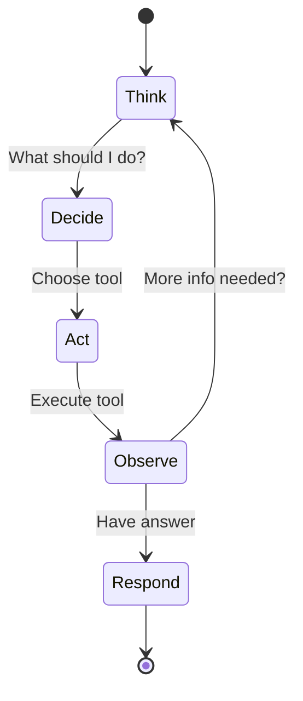
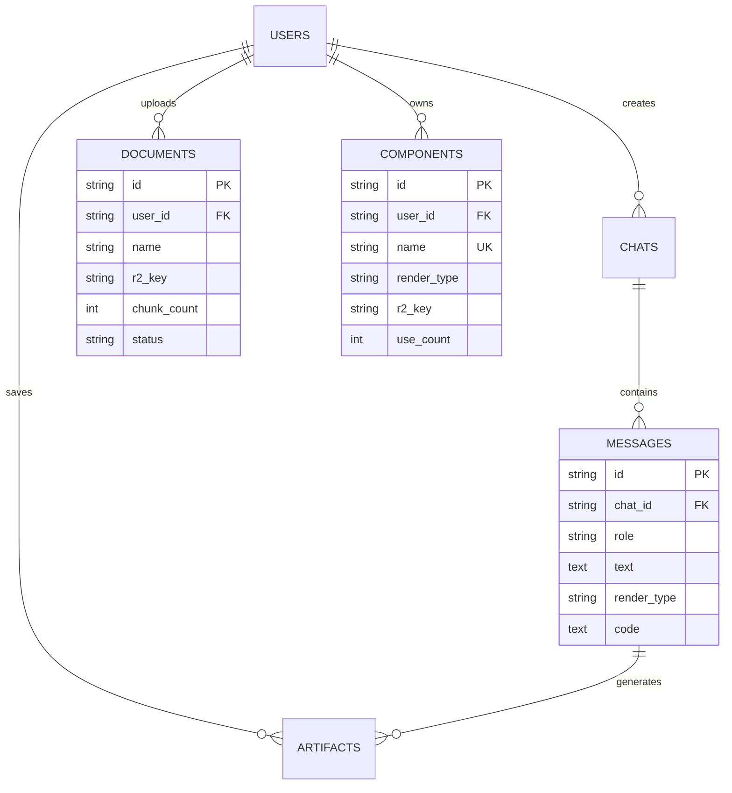

# VisualMind

> **AI-Powered Generative UI Chatbot SaaS** — Transform natural language into interactive dashboards, charts, and UI components in real-time.

---

## Overview

VisualMind is a full-stack AI chatbot SaaS that goes beyond text responses. When users ask questions, the system generates live, interactive UI components (charts, tables, forms, dashboards) rendered directly in the chat interface.

### Key Capabilities

- **Generative UI** — AI responses include interactive components, not just text
- **Knowledge Base (RAG)** — Upload documents; AI answers are grounded in your data
- **Component Registry** — Reusable UI components are cached and re-used
- **ReAct Reasoning** — Multi-step thinking with tool orchestration
- **Streaming Responses** — Real-time thinking steps + final output

---

## Architecture

```mermaid
flowchart TB
    subgraph Client["Frontend (React + Vite)"]
        UI[Chat Interface]
        Renderer[UI Renderer]
        KBUI[Knowledge Base UI]
    end

    subgraph Edge["Edge Layer (Cloudflare Workers)"]
        Auth[Clerk Auth Middleware]
        Router[API Router]
        Agent[ReAct Agent]
    end

    subgraph AI["AI Layer"]
        LLM[LLM (GPT-4o)]
        Tools[Tool Orchestration]
    end

    subgraph Storage["Storage Layer"]
        D1[(D1 Database)]
        R2[(R2 File Storage)]
        Vec[(Vectorize)]
    end

    UI -->|Streaming SSE| Router
    Router --> Auth
    Auth --> Agent
    Agent --> LLM
    Agent --> Tools
    Tools -->|RAG Search| Vec
    Tools -->|Component Lookup| R2
    Agent --> D1
    Renderer -->|iframe srcdoc| UI
    KBUI -->|Upload| R2
```

---

## How It Works



---

## Tech Stack

| Layer | Technology |
|-------|------------|
| **Frontend** | React 18, TypeScript, Vite, Tailwind CSS |
| **Authentication** | Clerk (JWT verification at edge) |
| **Backend Runtime** | Cloudflare Workers (serverless edge) |
| **Database** | Cloudflare D1 (SQLite) |
| **Vector Store** | Cloudflare Vectorize |
| **File Storage** | Cloudflare R2 |
| **LLM Orchestration** | LangChain.js |
| **Reasoning Pattern** | ReAct (Reason + Act) |

---

## Project Structure

```
visualmind/
├── frontend/                    # React + Vite + Tailwind
│   ├── src/
│   │   ├── components/
│   │   │   ├── chat/           # Chat UI, message bubbles, visual panel
│   │   │   ├── kb/             # Knowledge base upload & management
│   │   │   ├── artifacts/      # Saved visual outputs
│   │   │   ├── registry/       # Component registry UI
│   │   │   └── shared/         # Sidebar, topbar, status badges
│   │   ├── pages/              # Route pages
│   │   ├── hooks/              # useStream, useRegistry, useKnowledgeBase
│   │   ├── lib/                # API client, renderer, markdown utils
│   │   └── contexts/           # Theme, sidebar state
│   └── package.json
│
├── worker/                      # Cloudflare Worker (TypeScript)
│   ├── src/
│   │   ├── index.ts            # Main router
│   │   ├── routes/             # Chat, KB, artifacts, registry endpoints
│   │   ├── lib/
│   │   │   ├── agent.ts        # ReAct reasoning agent
│   │   │   ├── tools/          # RAG, web search, registry tools
│   │   │   ├── rag.ts          # Streaming response handler
│   │   │   └── registry.ts     # Component CRUD logic
│   │   └── middleware/         # Clerk auth verification
│   └── migrations/             # D1 schema migrations
│
├── shared/
│   └── types.ts                # Shared TypeScript types
│
└── README.md
```

---

## Features Deep Dive

### 1. Generative UI

The AI doesn't just return text — it generates interactive UI components:



**Supported Component Types:**
- Charts (bar, line, pie, scatter) via Chart.js CDN
- Data tables with sorting and filtering
- Metric cards and KPI displays
- Interactive forms with state
- Dashboards with multiple widgets

### 2. Knowledge Base (RAG)

Upload documents and ask questions grounded in your data:



### 3. Component Registry

Generated components are saved and reused:



### 4. ReAct Reasoning

The agent uses a Reason-Act-Observe loop:



**Available Tools:**
| Tool | Purpose |
|------|---------|
| `rag_search` | Search knowledge base documents |
| `web_search` | Search the web for current information |
| `registry_lookup` | Find reusable UI components |
| `generate_component` | Create new UI component |

---

## Database Schema



---

## Getting Started

### Prerequisites

- Node.js 18+
- Cloudflare account (free tier works)
- Clerk account for authentication
- OpenAI API key (or compatible LLM)

### 1. Clone & Install

```bash
git clone https://github.com/yourusername/visualmind.git
cd visualmind

# Install frontend dependencies
cd frontend && npm install

# Install worker dependencies
cd ../worker && npm install
```

### 2. Cloudflare Setup

```bash
# Create D1 database
wrangler d1 create visualmind

# Create Vectorize index
wrangler vectorize create visualmind-kb --dimensions=2048 --metric=cosine

# Create R2 bucket
wrangler r2 bucket create visualmind-storage
```

### 3. Configure Environment

**Frontend (`frontend/.env`):**
```env
VITE_CLERK_PUBLISHABLE_KEY=pk_test_xxx
VITE_API_URL=http://localhost:8787
```

**Worker (`worker/.dev.vars`):**
```env
CLERK_SECRET_KEY=sk_test_xxx
LLM_API_KEY=sk-xxx
LLM_BASE_URL=https://api.openai.com/v1
FRONTEND_URL=http://localhost:5173
```

### 4. Run Migrations

```bash
cd worker
wrangler d1 execute visualmind --file=migrations/001_initial.sql --local
```

### 5. Start Development

```bash
# Terminal 1: Start worker
cd worker && npm run dev

# Terminal 2: Start frontend
cd frontend && npm run dev
```

Open [http://localhost:5173](http://localhost:5173) in your browser.

---

## API Reference

### Chat

```
POST /api/chat/stream
```

Streaming endpoint for chat queries. Returns SSE events:

```json
// Thinking step event
{ "type": "thought", "step": { "thought": "...", "action": "rag_search", ... } }

// Final response event
{ "type": "response", "content": { "text": "...", "renderType": "html", "code": "..." } }
```

### Knowledge Base

| Endpoint | Description |
|----------|-------------|
| `GET /api/kb/documents` | List all documents |
| `POST /api/kb/upload` | Upload new document |
| `DELETE /api/kb/documents/:id` | Delete document |

### Component Registry

| Endpoint | Description |
|----------|-------------|
| `GET /api/registry` | List saved components |
| `POST /api/registry/save` | Save new component |
| `DELETE /api/registry/:name` | Delete component |

### Artifacts

| Endpoint | Description |
|----------|-------------|
| `GET /api/artifacts` | List saved artifacts |
| `POST /api/artifacts/save` | Save artifact from chat |
| `DELETE /api/artifacts/:id` | Delete artifact |

---

## Response Format

The LLM returns structured JSON for every response:

```typescript
type LLMResponse = {
  text: string;                          // Text explanation
  renderType: 'none' | 'html' | 'react'; // UI type
  componentName?: string;                // Reuse existing component
  props?: Record<string, unknown>;       // Data for component
  code?: string;                         // Generated HTML/JSX
  saveAsComponent?: {                    // Save to registry
    name: string;
    description: string;
    propsSchema: Record<string, string>;
  };
  sources?: Array<{                      // RAG citations
    documentName: string;
    chunk: string;
  }>;
}
```

---

## Deployment

### Frontend (Cloudflare Pages)

```bash
cd frontend
npm run build
wrangler pages deploy dist
```

### Worker (Cloudflare Workers)

```bash
cd worker
wrangler deploy
```

### Set Production Secrets

```bash
wrangler secret put CLERK_SECRET_KEY
wrangler secret put LLM_API_KEY
```

---

## Security

- **Authentication**: Clerk JWT verification at edge
- **Multi-tenancy**: All data scoped to user ID
- **Sandboxed Rendering**: UI components run in `sandbox="allow-scripts"` iframes
- **No External Resources**: Only Tailwind CDN and Chart.js allowed in generated code

---

## License

MIT License — see [LICENSE](LICENSE) for details.

---

> Built with Cloudflare Workers, LangChain.js, and React